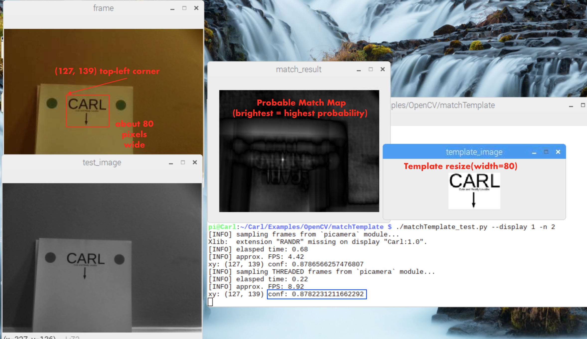
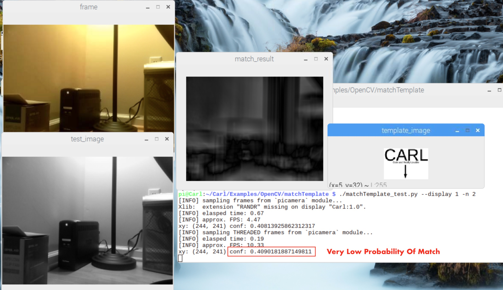
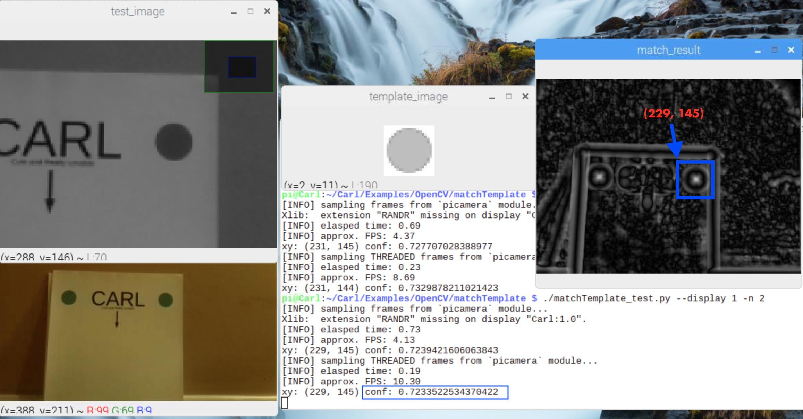

# OpenCV cv2.matchTemplate Processing To Recognize Docking Sign


Config:  RPi 3B 320x240 32fps source, MATCH_METHOD = 5 TM_CCOEFF_NORMED

```
USAGE:
  $ python matchTemplate_test.py    # run test without displaying images
  $ ./matchTemplate.py --display 1  # run test display images
  $ ./matchTemplate.py -n 2         # only test 2 frames
```

Result: 
  Frame taken from video at approach point to dock (17" camera to sign)
  Template converted to gray-scale and resized to width = 80
  Image converted to gray-scale
  cv2.matchTemplate() returns result map
  cv2.minMaxLoc() returns upper-left corner of template best match
                  and confidence around 88% for real docking sign
                  vs  confidence around 41% for not docking sign

Notes:
  matchTemplate is a fairly slow function
  matchTemplate is very dependent on the template width being close to the matching image area width

**Dock Sign Match 88%**


**Not Dock Sign Match 41%**


For comparison matching with Docking Sign Target at width=20 pixels:

Dock Target Match was 72%
Not Dock Target Match was 55%




