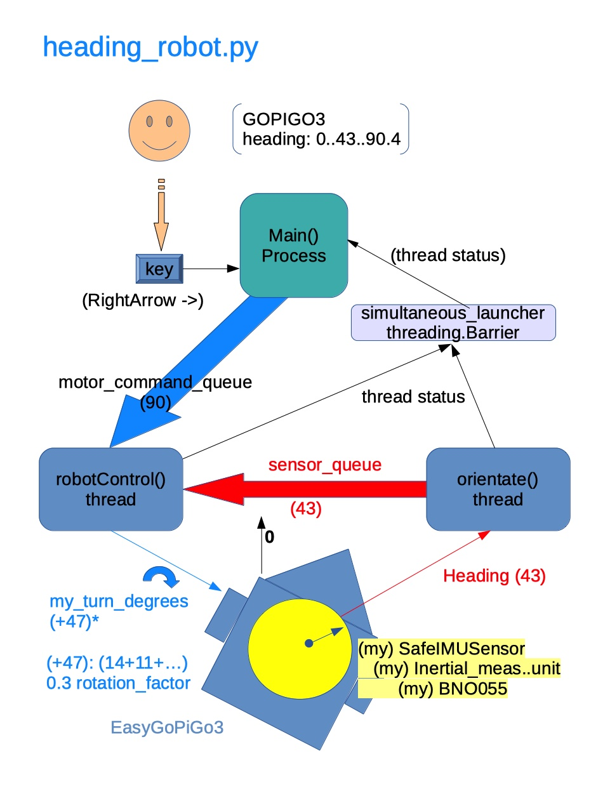

## **HEADING ROBOT**

heading_robot.py uses the Dexter Industries Inertial Measurement Unit (BNO055 chip) 
in IMUPLUS mode (Fusion from Gyros and Accelerometers only, no magnetometers) to 
orient the GoPiGo3 robot with respect to the orientation when the program is started as 0 degrees.


heading_robot.py uses three IMU interface layers (modified DI IMU classes)
 - my_safe_inertial_management_unit.py  SafeIMUSensor() class
 - my_inertial_management_unit.py       InertialMeasurementUnit() class
 - myBNO055.py                          BNO055() class

These classes implement features above the DI IMU standard interface:
- Initialization of HW in IMUPLUS mode (Fusion using only Gyros and Accels, no mags)
- Safe “reset and remap axes” method to set heading to 0
- Tracking of soft I2C exceptions
- Software Only Interface Object initialization to allow HW access/control without setting mode
- Multi-process safe program to read values from IMU without knowing current mode
- verbose options for greater visibility into IMU operations
- di_i2c mutex protected access to more BNO055 methods

heading_robot architecture is based on the superb compass_robot example designed by Robert Lucian Chiriac




# Get The Code:

```
cd ~ 
curl -LJO https://github.com/slowrunner/Carl/raw/master/Examples/imu/di_BNO055/headingbot/headingbot.tar.gz 
tar -xzvf headingbot.tar.gz
cd headingbot
```

# Usage:

1) Mount Dexter Industries Inertial Measurement Unit Point-up, chip to front
2) Connect IMU to GoPiGo3's AD1 port
3) Orient GoPiGo3 to some reference such as floor board joints or taped line on floor
4) ./heading_robot.py


5) Press arrow keys for shortcut to 0, 90, 180, 270
   or enter a direction such as 45, then press return
6) Watch for robot to complete re-orienting
7) Check what heading the robot "thinks" it is pointed (IMU heading)
8) Optionally press "f" key to make robot move forward, press "Space" key to stop
9) Press ctrl-c to exit

# Notes:
- Initial orientations will be close to the measured heading, 
  but eventually will show effect of IMU drift.
- IMUPLUS mode is used because the motors, encoder magnets, and indoor magnetic fields
  wreak havoc with the IMU in NDOF mode
