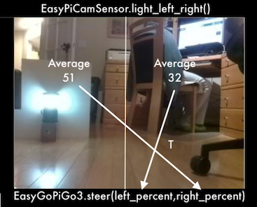

**(IN-PROGRESS)**

# Easy PiCamera Sensor Class For GoPiGo3 Robots

Python3 Class to treat the PiCamera as a unified family of GoPiGo3 robot sensors 

including:
- Left, Front, Right Light Intensity (0-100)
- Motion Detector (Left, Right, Up, Down)
- Color Detector With Color Table ReLearning 
  (Black, Brown, Red, Orange, Yellow, Green, Blue, Violet, White)
- Maximum Intensity area horizontal angle from center and value (0-100)  
- 320x240 RGB image save to JPEG file or retrieve as numpy array

Refresh rate is roughly 10 per second.

# To Bring Down To Your GoPiGo
```
wget https://github.com/slowrunner/Carl/raw/master/Projects/EasyPiCamSensor/EasyPiCamSensor.tgz 
tar -xzvf EasyPiCamSensor.tgz
```

# Requirements

Python Requirements (Stock ModRobotics Rasbian_For_Robots):
- Python3
- picamera
- threading
- colorsys
- PIL  
- numpy
- (Does not use/require OpenCV)

Note:  The tgz contains a version of easygopigo3.py with a working steer(lft_pct,rt_pct) method
- For use with the Braitenberg Vehicle examples 
- The current ModRobotics easygopigo3.py steer() method has a problem. 

# API

-  epcs = easypicamsensor.EasyPiCamSensor()   # Create sensor object

-  light() # return average intensity across entire sensor (0.0 pitch black to 100.0 blinding light)

-  light_left_right() # return average intensity across left half and right half of sensor

-  color() # returns estimate of color of central area of sensor

-  color_dist_method() # returns nearest color with distance and method ("RGB" or "HSV") used 

-  motion_dt_x_y() # returns time of first motion left|right and/or up|down since last method call

-  save_image_to_file(fn="capture.jpg")  # saves last image to file encoded as JPEG

-  get_image()  # returns RGB numpy image array

-  learn_colors() # learn one or more colors with optional TTS prompting

-  print_colors() # print the current color table

-  known_color(color_name) # returns True if color_name is in the current color table

-  save_colors() # save color table in config_easypicamsensor.json file

-  read_colors()  # reads color table from config_easypicamsensor.json file


# EasyPiCamSensor Example Programs:

- i_see_color.py [-h] [-v]
  * Uses EasyPiCamSensor.color() and optionally [-v] espeakng TTS to report estimate color seen
  * User selects either RGB or HSV color matching method (RGB is much better than HSV)
  * Target_Colors.pdf provides color samples that match the default sensor color table 
    (Print on matte photo paper for best results)


- i_see_light.py
  * Comments when someone turns a room light on or off

- i_see_motion.py
  * Reports first motion and datatime since last report
  * Recognizes left or right, up or down motion

- i_see_colors_in_motion.py [-h] [-v]
  * Prints and optionally [-v] speaks last motion and color 
  * Saves image of motion to motion_capture.jpg


- face_the_light.py [-h] [-v]
  * Turns GoPiGo3 robot to face the brightest area in room
  * Option [-v] narrates with Text-To-Speech

- braitenberg2B.py [-h] [-v] [-g N.n] [-s]
  * implements Braitenberg Vehicle 2B "loves light"
  * Uses left and right light intensity as stimulus for the opposite side wheel
  * Implementation adds obstacle inhibition of forward motion for vehicle protection
  * Option [-v] narrates with Text-To-Speech
  * Option [-g N.n] introduces stimulus amplification with given gain.  [Default 1.0]



[Video: GoPiGo3 "Carl" w/EasyPiCamSensor Braitenberg Vehicle 2B](https://vimeo.com/493585330)

- simple_braitenberg2A.py
  * implements Braitenberg Vehicle 2A "loves the dark" 
  * Uses left and right light intensity as stimulus for the same side wheel
  * Implementation adds obstacle inhibition of forward motion for vehicle protection
  * (Does not use TTS)

- teach_me_colors.py
  * Allows adding or re-learning one or more colors 

- delete_a_color.py
  * Allows testing and easily deleting a poor performing color from the config_easypicamsensor.json file


