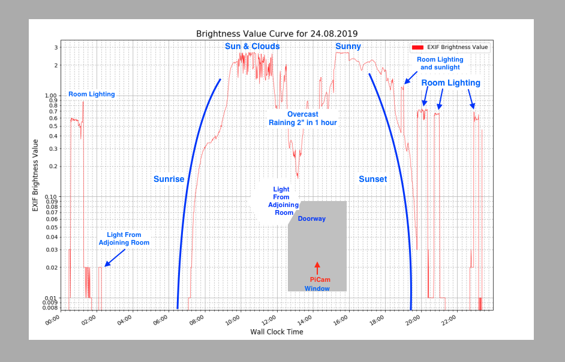

# Log and Plot Brightness Value Using PiCamera

Project to monitor light level using picamera JPG format EXIF Brightness Value,
and generate a 12am to 12pm plot 

The PiCamera pointed horizontal 10 inches off the floor, records a Brightness Value: 
- exactly 0.0 for total darkness
- roughly 0.05 in a dark room with light streaming through the doorway from kitchen 30 feet away
- roughly 0.7 for a small room lit only by 150 watt overhead lighting
- roughly 1.5 for a small room with one large window during end of the world storm outside
- roughly 2.6 for a small room with one large window with partial blinds and full sun outside

Based on:
- Understanding Brightness Value: https://www.raspberrypi.org/forums/viewtopic.php?t=44784#p357111
- Python access to EXIF data of jpg files https://pypi.org/project/ExifRead/
- Plotting in Python: https://plot.ly/python/
- PiCamera  https://picamera.readthedocs.io/en/release-1.13/recipes1.html#capturing-to-a-file

Example plot:  

  

**Introduction:**  

- To collect light data:
  python(3) captureLightValue.py    
  ./captureLightValue.py   
  ./captureLightValue.py > logBV.out 2>&1 &  

- To plot collected light data:
  ./plotLight.py  logfiles/bv-YYYYMMDD-HHMM.csv
 
- captureLightValue.py:  Captures jpg file every 60 seconds to images/bv-<date>-<time>.jpg, 
  reads jpg EXIF, and writes brightness value to csv file in logfiles/bv-<date>-<time>.jpg  
- plotLight.py: Creates a log plot of EXIF Brightness Value vs wall-clock-time in plots/bv-<date>-<time>.png   

- .csv files are written to      <base_folder>/logfiles/         (created if not existing)  
- .png plot files are written to <base_folder>/plots/            (created if not existing)  
- .jpg files are written to      <base_folder>/images/           (created if not existing)

**Hardware:**  
- Raspberry Pi 3 running with Raspbian.
- Raspberry Pi Camera v1.3
- [DexterIndustries GoPiGo3]

**Installation:**  
- If desire output in a specific place, set base_dir variable:  ./ is the default

Packages needed to be installed:  
-matplotlib  (sudo pip install matplotlib)  
-plotly  
-exifread  (sudo pip install exifread))
  
Requires:
- Carl/plib/camUtils.py  for camUtils.snapJPG()
