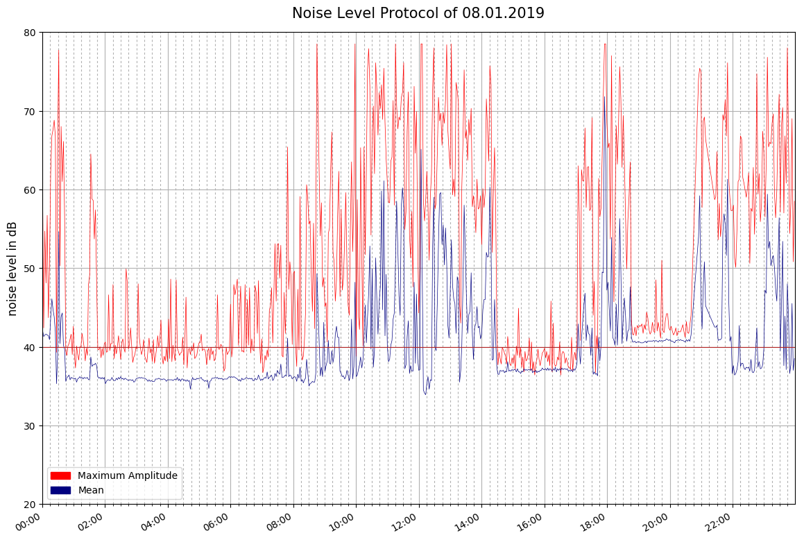
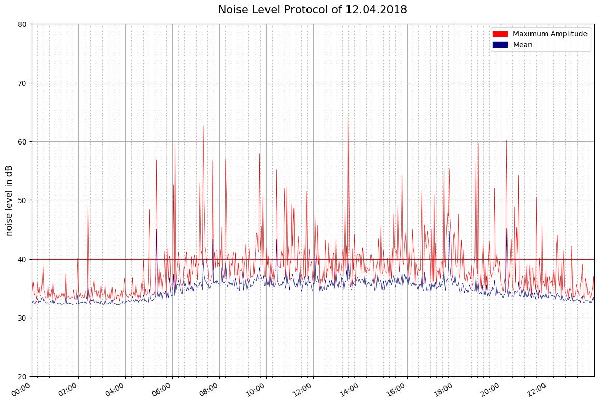

# Log Value And Print

GoPiGo3 project to monitor battery voltage, and generate plot of last "life period" 

Example battery-only cycle:  

  

Example battery-only, recharge-period, followed by trickle-period:  

**Introduction:**  

- To run it:
  python3 logBattV.py  or ./logBattV.py   or ./logBattV.py > logBattV.out 2>&1 &   
  python3 plotBattV.py  
 
- logBattV.py:  Checks battery voltage periodically, and writes value to csv file
- plotBattV.py: Creates a graphic of voltage vs wall-clock-time in battV-<date>.png   

- .csv files are written to      <base_folder>/battV/csv/         (created if not existing)  
- .png plot files are written to <base_folder>/battV/pic/         (created if not existing)  

**Hardware:**  
- Raspberry Pi 3 running with Raspbian.
- DexterIndustries GoPiGo3
- 8 EBL 2800mAh NiMH AA-cells
- Tenergy 1025 6-12v (5-10 cell) Smart Charger, 1A-2A selectable 

**Installation:**  
- If desire output in a specific place, set base_dir variable:  ./ is the default

Packages needed to be installed:  
-matplotlib  (sudo pip install matplotlib)
-plotly  

  

