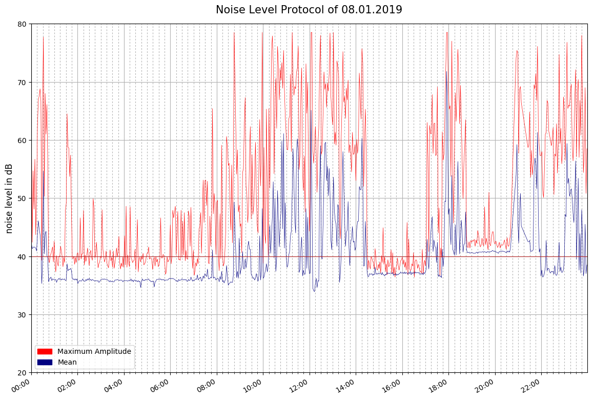

# RaspberryPi Recording Sound Meter and Plot

Raspberry Pi/Python project to monitor noise levels, save recordings, and plot up to 24 hours of measurements

This is my 24hr test:  

  

This is the example plot from Mob-Barley:  

**Introduction:**  
This is based on https://github.com/Mob-Barley/noise_level_protocol.
- To run it:
  python3 calibrate.py    
  python3 mydetect.py  
  python3 myplot.py  
 
- mydetect.py:  Monitor loudness, save recording if above A-weighted peak or RMS thresholds
- (Use calibrate.py to create values for equation for peak and RMS A-weighted loudness for selected microphone)
- (Use myplot.py to create 24 hour plots of peak and RMS results)
- mydetect.py records a 48kHz 16bit mono wave file for the set duration using arecord,  
  then uses "SoundExchange" program sox to extract the peak and rms amplitudes between 0=no sound to 1.0 loudest  
  Next the amplitudes are converted to "estimated" standard A-weighted loudness values  
  using a nonlinear 4 parameter logistic regression (single sided sigmoidal equation):  
  y = d + (a - d)/(1 + (x / c)**b)  
  If either the peak or RMS A-weighted loudness values are above trigger thresholds,  
  the date-time, Peak and RMS loudness values are appended to a comma-separated-values (csv) file,  
  the wav file is compressed using lame to an mp3 file for later review.  
  The wav file is deleted at the end of this loop, or upon cntl-C detection.  
- .wav and .mp3 files are written to <base_folder>/audio/<date>/  (created if not existing)  
- .csv files are written (one per day) to <base_folder>/csv/      (created if not existing)  
- .png plot files are written to <base_folder>/pic/               (created if not existing)  

I made the following mods/"improvements" for my use:  
- removed requirement to make_dirs.py (programs will create any needed folders)
- broke the record and compress steps apart.  Program records to a .wav file, if above threshold, it compresses to .mp3.
- my mic is only one channel, so record -c1 and convert -m m (mono)
- my mic only works well at 48kHz, so record and convert at 48kHz
- removed some sleeps where possible
- commented all the clear lines so output can be scrolled back to view.
- created a calibrate.py program specifically for collecting calibration data

**Requirements:**  
- peak and RMS loudness detection
- save timestampped loudness to daily csv file  
- save mp3 compressed sound recording if above selectable thresholds for later analysis 
- create a noise level plot every day  
  

**Hardware:**  
- Raspberry Pi 3 running with Raspbian.
- USB mic (I'm using Kinobo "Mini Akira")

**Installation:**  
- The base directory is set in base_dir variable:  ./ is the default
- The microphone has to be set up and accessible as plughw:1,0. 
- The program records all the time, and then deletes quiet files.

Packages needed:  
-plotly  
-lame  
-sox  

1. Ensure pip, setuptools, and wheel are up to date: sudo python -m pip install --upgrade pip setuptools wheel  
   sudo pip install plotly  
   sudo apt-get install lame sox libsox-fmt-mp3  

2. Make sure your microphone is seen:  lsusb  shows something like Bus 001 Device 004: IC xxxx JMTek, LLC.  
   Try a recording:  arecord -D plughw:1,0 -d 7 -c 1 -f S16_LE -r 48000 test48.wav  
   Play the recording: aplay test48.wav   (should be clear, not scratchy like 8k default recording)  

3. Calibrate your microphone: 
   With Audacity, generate a 1 minute PinkNoise.mp3 (0.8 Pink)  
   Setup in a very quiet carpeted room to play the PinkNoise.mp3 through a speaker with the microphone about 6 inches away.  
   Set a soundmeter (configure A-Weighted dBA, slow, enable prevent sleep) near the microphone - iOS app Decibel X Pro ($5.99) works very well.  
   Reset soundmeter Max for next test  

   Run Calibrate.py in total quiet (without PinkNoise).  Record the minimum measured values "peak: 0.xxxx  RMS: 0.xxxx"
   
   Start PinkNoise.mp3, increase volume till soundmeter registers as close to 30 dBA as possible.  
   Start Calibrate.py, note the soundmeter reading and the peak and RMS measured values.  

   Repeat increasing the volume of PinkNoise by 5 dBA and record measurements till 80 or 90 dB.  
  
4. Browse to https://mycurvefit.com/  
   Replace X Axis Title with "Peak Reading" - choose logarithmic  
   Replace Y Axis Title with "dBA" - choose logarithmic  
   Paste Peak Data: e.g.  
       0.0058               27  
       0.006                30  
       0.007                35  
       0.009                39          
       0.017                46        
       0.029                51       
       0.052                56          
       0.099                61         
       0.175                65          
       0.314                70     
       0.55                 75            
       0.947                80         
   Select Fit Method->Nonlinear->4PL  
   Select Weighting->None  
   Copy down dBA equation:  
   a = -3989824  b=0.1744041, c=7.172477 * (10 ** -30), d= 111.4455  
   y = d + (a - d)/(1 + (x/c)**b)  

5. Repeat for RMS equation

6. Open mydetect.py, set the peak_a,b,c,d and rms_a,b,c,d values  
   Set thresholds (suggest 50 peak, 40 RMS)  
   Choose a recording time:  shorter makes reviewing a recording for noises easier, longer makes plots smoother looking  

7. Repeat playing PinkNoise at 40 60 and 80 dBA, to verify mydetect.py loudness values approximately match the soundmeter (+/-3dBA)

9. Data can be plotted with myplot.py - view plots in ./pic/
  

